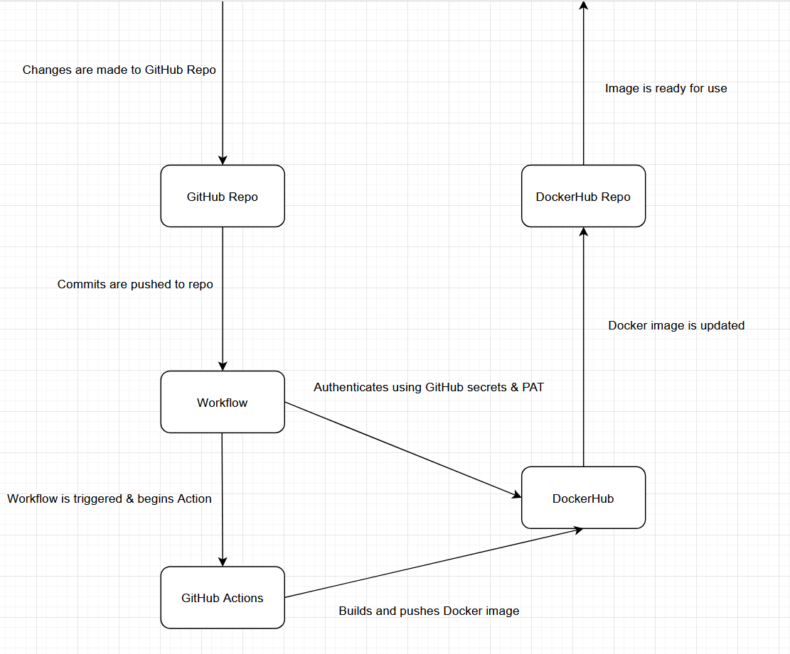

# Part 1

## Docker Setup

#### Installing Docker Desktop

1. Navigate to [https://www.docker.com/](https://www.docker.com/).
2. Hover over "Download Docker Desktop".
3. Select a downloader based off of your operating system.
4. Once downloaded open "Docker Desktop Installer.exe".
5. Navigate through the installer menu to install Docker Desktop.
6. Once Installed launch Docker Desktop.

 

#### Testing if Docker is Installed

It is recommended to use a bash shell for the next steps. 

A guide to installing WSL can be found here: [https://learn.microsoft.com/en-us/windows/wsl/install](https://learn.microsoft.com/en-us/windows/wsl/install)

Using WSL I check if docker is installed using the following command:

        docker --version

This command will list the current version of docker, it if lists a version then you have successfully installed docker.

 

My reference for installing Docker desktop: [https://docs.docker.com/get-docker/](https://docs.docker.com/get-docker/)

My Reference for testing docker: [https://docs.docker.com/get-started/](https://docs.docker.com/get-started/)

 

## Manually Setting up a Container

To setup a Docker container for our specific use I used the following command:

        docker run -it -p 4200:4200 -v $(pwd)/angular-site:/app node:18-bullseye bash
 

Command Breakdown:

docker run - Starts a new Docker container from an image.

-it - i Keeps STDIN open and t allows you to use a terminal inside of the container.

-p 4200:4200 - Maps host port 4200 to container port 4200.

-v $(pwd)/anuglar-site:/app - Mounts angular-site directory to the working directory

node:18-bullseye - The Docker image being used which is Node.js 18 on Debian Bullseye.

bash - Starts a bash shell in the container.

 

Once the container is running a few dependencies need installed to run the application:

        cd /app
        npm install
        npm start
 

The resource I used for the docker run command was ChatGPT, I gave it the prompt "Run a container with the node:18-bullesye container image and configure it to run and server the Angular application in angular-site".

The resource I used for the dependencies was Chatgpt, I gave the prompt "List me the dependencies i need to run Angular with".

## Creating a Dockerfile and Building Images

Creating a Dockerfile to automatically create containers is a simple and efficent task.

The following is my example Dockerfile that I used to create a container similar to the one we created in the previous step:

        FROM node:18-bullseye

        WORKDIR /app

        COPY angular-site/ .

        RUN npm install

        CMD ["npm", "start"]

FROM - The base image that is used for the container.

WORKDIR - The working directory inside of the container.

COPY - Copying over the site files we are going to host.

RUN - Runs the install command to install Node.js dependencies.

CMD - Runs npm start to start the Angular dev server.

 

The resource I used to create this Dockerfile was Chatgpt, I gave it the prompt "Generate me a dockerfile based off of the previous docker run command".

## Working with Dockerhub

### Creating a Public Repository

1. Naviagte to [https://hub.docker.com/](https://hub.docker.com/).
2. Sign in and you should immediately be taken to hub.docker.com/repositories/(your name)
3. Click "Create a repository".
4. Give your repository a name and select the public button.

Your Public repository is now created.

 

### Creating & Using a PAT

A personal access token, or PAT, is a way to authenticate to Dockerhub without using your password. This allows you to grant other users access to your repositories without giving them access to your account and password.

The steps to generate a PAT are as follows:

1. Navigate to [https://app.docker.com/settings/personal-access-tokens](https://app.docker.com/settings/personal-access-tokens).
2. Click "Generate new token".
3. Give the token an accurate description and an expiration date if needed.
4. Under Access permissions select "Read & Write".
5. Select "Generate"

Your PAT token has now been created and is ready for use. Using "Read & Write" as the permissions for the PAT should be perfect for our overall goals, this way you will have all the same permissions as if you logged in with your username and password.

 

Logging in with your PAT is simple and easy.

1. Open your bash terminal and type "docker login"
2. Enter your username and your PAT token to login.

You should now be logged in with your Dockerhub account.

 

My DockerHub Repo: [https://hub.docker.com/repository/docker/jordanhenman/henman-ceg3120/general](https://hub.docker.com/repository/docker/jordanhenman/henman-ceg3120/general)

The resource I used for creating a repo was: [https://docs.docker.com/docker-hub/repos/](https://docs.docker.com/docker-hub/repos/)

The resource I used for creating a PAT was: [https://docs.docker.com/docker-hub/access-tokens/](https://docs.docker.com/docker-hub/access-tokens/)

The resource I used for command line login was: [https://docs.docker.com/engine/reference/commandline/login/](https://docs.docker.com/engine/reference/commandline/login/)

# Part 2

*Creating a PAT was already covered in part 1 of this project.*

### Creating & Using Repository Secrets

Secrets are encrypted environment variables that can be stored in your GitHub repo. These act as credentials you can use to authenticate into other services.

1. Navigate to your Github Repo.
2. Go to Settings, Secrets and variables, and select Actions.
3. Click "New repository secret".

Two secrets need created to successfully authenticate with DockerHub.

Your username secret:

        DOCKER_USERNAME
        
        *Enter your username for DockerHub.*

Your token secret:

        DOCKER_TOKEN
        
        *Enter your PAT that you previously created.*

Resource I used for creating secrets: [https://docs.github.com/en/actions/security-guides/encrypted-secrets](https://docs.github.com/en/actions/security-guides/encrypted-secrets)

 

### Workflow Creation

A workflow is a file writted in YAML that essential tells GitHub to execute a task when something occurs.

For example my workflow file:
1. Runs everytime code is pushed to the main branch.
2. Creates a job titled "build-and-push".
3. Runs Ubuntu on a virtual machine.
4. Pulls the latest code from the repo to use as a Docker image.
5. Logs into my DockerHub account using my previously created secrets.
6. Creates an environment using Buildx.
7. Builds the Docker image from my project repo.
8. Pushes the built image to DockerHub.

 

Link to my workflow: [https://github.com/WSU-kduncan/ceg3120-cicd-JordanHenman/blob/main/docker-publish.yml](https://github.com/WSU-kduncan/ceg3120-cicd-JordanHenman/blob/main/docker-publish.yml)

The resource I used to generate this workflow was ChatGPT, I provided the following prompt "Set up a GitHub Actions workflow to build and push container images to your DockerHub repository, workflow should trigger when a commit is pushed to the main branch, workflow should utilize repository secrets for authentication, workflow should utilize actions as opposed to run commands."

Another resource I used: [https://docs.github.com/en/actions/using-workflows/workflow-syntax-for-github-actions](https://docs.github.com/en/actions/using-workflows/workflow-syntax-for-github-actions)

 

### Workflow Testing

There is several ways to test if your workflow is valid and working correctly.

Test 1: 

Push a new commit to the main branch.

Pushing a commit to the main branch will update your repo in DockerHub, naviagting there and checking the most recent timestamp should show when you made that commit.

 

Test 2: 

Check the GitHub actions workflow status.

Looking at the Actions tab inside your github repository should display a green checkmark next to the latest workflow run. If a red X appear something has gone wrong and your workflow is probably not configured correctly.

 

After testing if the workflow is correct you can test the image to see if everything is correct on the DockerHub side.

You can start and run your image with the following commands:

        docker pull your-dockerhub-username/your-repo-name:latest

        docker run -t-p 8080:80 your-dockerhub-username/your-repo-name:latest

*Make sure to replace your-dockerhub-username/your-repo-name with your username and repo information.*

 

With these command completed you should be able to open any web browser and naviage to [http://localhost:8080](http://localhost:8080).

There you should see your application running.

 

Resource I used for workflow testing: [https://docs.github.com/en/actions/monitoring-and-troubleshooting-workflows/monitoring-workflow-runs](https://docs.github.com/en/actions/monitoring-and-troubleshooting-workflows/monitoring-workflow-runs)

# Part 3

### Project Goals & Tools Used

The main goal of this project was to set up an automated Continous Integration pipeline using Actions from GitHub. These Actions build a Docker image whenever changes are pushed to the main branch, authenticates with DockerHub, and pushes the new image to our pubic DockerHub repository.

The tools we used to complete our goals are as follows:

- Angular - Used to build a dynamic web application.
- GitHub Actions - Used to automate workflow steps such as building and pushing Docker images.
- Personal Access Tokens - Used to authenticate to services without using a password.
- Docker File - Used to automatically create Docker images.
- Docker Desktop - Used to containerize our angular application.
- DockerHub - Used to host our Docker images.
- Git - Used to track code changes.

 

### Diagramming

 

### Resources

The resources I used are scattered throughout my document.
